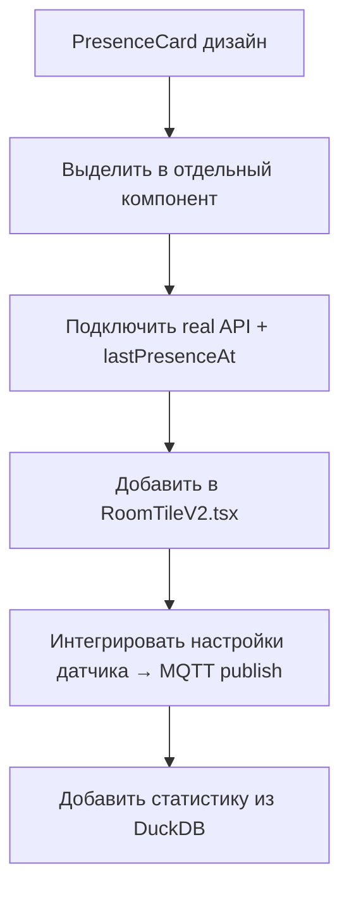

# Presence Card — Design Reference

> **Дата:** 2026-07-02  
> **Дизайнер (исходный код):** @D  
> **Статус:** Design approved — awaiting implementation

---

## Design Tokens

| Token | Value | Usage |
|-------|-------|-------|
| `--bg` | `#0A0C0B` | Фон страницы (почти чёрный, тёплый подтон) |
| `--glass-bg` | `rgba(20,26,22,0.55)` | Фон карточки (стекло) |
| `--glass-border` | `rgba(201,162,71,0.14)` | Кайма карточки |
| `--gold` | `#C9A24B` | Акцент, статус, бренд |
| `--green-live` | `#5CC98A` | Присутствие / "жизнь" |
| `--green-dim` | `#4F8F68` | Присутствие muted |
| `--amber` | `#7A5C2E` | Приглушённый янтарь (вторичные элементы) |
| `--danger` | `#B23B34` | Тревога (батарея, таймаут) |
| `--text-primary` | `#E9E4D8` | Основной текст |
| `--text-dim` | `#8B9088` | Приглушённый текст |
| `--text-muted` | `#5A5F58` | Ещё более приглушённый |

### Typography

| Назначение | Font | Size |
|-----------|------|------|
| Заголовки, числа | `Cormorant SC` (serif) | 500–700 weight |
| Акцентный текст | `Cormorant Garamond` (serif, italic) | 500–600 weight |
| Тело | `Inter` (sans-serif) | 400–600 weight |
| Метрики (%, мин, ID) | `JetBrains Mono` (monospace) | 400–500 weight |

---

## Screenshot / Preview

Исходная реализация — React компонент `PresenceCard` (`PresenceCard.tsx`).  
Файл с полным кодом: `design/PresenceCard_complete.tsx`

---

## Структура карточки

### COMPACT MODE (всегда видно)

```
┌─────────────────────────────────────────────┐
│  [●]  Прихожая           🔋84%  📶92   ▼  │
│       Есть · сейчас                         │
└─────────────────────────────────────────────┘
```

- Левая часть: иконка с пульсирующей точкой (зелёная = есть, серая = нет)
- Название комнаты (Cormorant SC, 19px)
- Статус "Есть" / "Нет" + время: "сейчас", "3 мин назад", "ушли 1.5 ч назад"
- Метрики: 🔋 батарея (красная <=10%, жёлтая <=20%), 📶 linkquality
- Шеврон раскрытия (золотой #C9A24B)

### EXPANDED MODE (при нажатии)

#### 1. Блок статуса
- Когда обнаружено: "Сейчас" / "—"
- Последний раз: "сегодня в 14:32"
- Срабатываний сегодня: счётчик
- Гистограмма активности по часам (24 бара):
  - Зелёный градиент (если активность есть)
  - Прозрачный серый (если нет активности)
  - Подписи каждый 4-й час
- Подпись: "Активность по часам, последние 24 ч"

#### 2. Настройки датчика
- **Чувствительность:** Low / Medium / High (сегментированный контрол)
- **Тайм-аут присутствия:** ползунок 10–600 сек (значение справа monospace #C9A24B)
- **Keep time:** ползунок 0–60 сек

#### 3. Сценарии (привязанные)
- 4 строки с переключателями:
  - ☀️ Включить свет при входе — ON
  - 📺 Выключить ТВ, если никого нет 15 мин — ON
  - 🌙 Ночник при движении (23:00–07:00) — OFF
  - ✉️ Уведомление в Telegram при входе — OFF
- Активные сценарии: золотая кайма, переключатель зелёный
- Неактивные: серые

#### 4. Статистика 7 дней
- Столбцы по дням (Пн–Вс): высота = часы присутствия
- Золотой градиент (C9A24B → 7A5C2E)
- Среднее отсутствие: "42 мин"
- Пик активности: "18:00–19:00"

---

## Стилизация

### Карточка
- `border-radius: 20px`
- `background: linear-gradient(165deg, rgba(24,30,25,0.72), rgba(14,18,15,0.72))`
- `backdrop-filter: blur(18px)`
- `border: 1px solid rgba(201,162,75,0.16)`
- `box-shadow: 0 24px 60px -20px rgba(0,0,0,0.7)`

### Edge glow (при присутствии)
- `box-shadow: 0 0 0 1px rgba(95,201,138,0.35), 0 0 24px rgba(95,201,138,0.10)`
- Плавное появление/исчезновение (transition 600ms)

### Пульсация точки присутствия
```css
@keyframes pc-pulse {
  0%   { box-shadow: 0 0 0 3px rgba(10,12,11,0.9), 0 0 0 0 rgba(92,201,138,0.55); }
  70%  { box-shadow: 0 0 0 3px rgba(10,12,11,0.9), 0 0 0 9px rgba(92,201,138,0); }
  100% { box-shadow: 0 0 0 3px rgba(10,12,11,0.9), 0 0 0 0 rgba(92,201,138,0); }
}
```

### Разворачивание
- `max-height: 0 → 1400px`
- `transition: max-height 420ms cubic-bezier(.4,0,.2,1)`

### Ползунки (range)
- Стилизованы под золотой thumb (#C9A24B) на тёмном фоне
- Трек: градиент от зелёного к прозрачному

---

## Файлы

- **Дизайн-код:** `design/PresenceCard_complete.tsx` — полный React компонент
- **Документация:** `design/PresenceCard_design.md` — этот файл

---

## План реализации



1. Скопировать `PresenceCard_complete.tsx` в `client-app/src/components/ui/`
2. Заменить demo-данные на real API (`device.last_presence_minutes`, `battery`, `linkquality`)
3. Заменить demo-переключатель присутствия на real `computed_status`
4. Интегрировать настройки (чувствительность, тайм-аут, keep time) → отправка MQTT команд
5. Гистограмма активности — запрос `GET /api/telemetry?device=...&property=presence&period=24h`
6. Статистика 7 дней — запрос агрегации по дням
7. Сценарии — привязать к `/api/scenarios`
